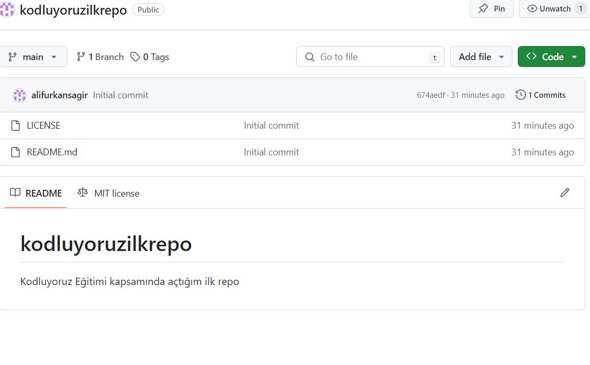

# Kodluyoruz Ilk Repo
 Bu repo [Kodluyoruz](https://www.kodluyoruz.org) Eğitimi kapsamında açtığım ilk repo

 )

 ## Installation
 
 Clone the repository from github with

 ````bash
 https://github.com/alifurkansagir/kodluyoruzilkrepo.git
````
## usage
Projeyi cloneladıktan sonra Visual Studio Code programında açınız.

Linux için;
````linux
cd kodluyoruzilkrepo
code .
````
## Contributing
Pull requestler kabul edilir. Büyük değişiklikler için, lütfen önce neyi değiştirmek istediğinizi tartışmak için bir konu açınız.

## License
[MIT](https://choosealicense.com/licenses/mit/)
